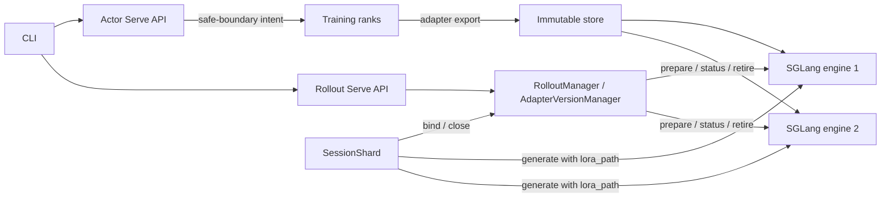
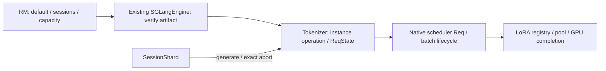

# RFC：不可变 LoRA 的发布、会话绑定与安全回收

状态：**实现评审稿；代码可审查，未完成全部兼容性接线，未通过真实 GPU／性能验收。**

更新：2026-09-23（测试去重、两小时性能诊断说明与提交重组）。本文描述当前分支的代码与仍缺少的能力，替代此前逐轮追加的设计稿。历史讨论与用户意见保留在 [review 记录](./immutable-lora-publication-review.md)。本轮整理前为 `dfceac7`，课题基线为 `4cb07d8`；原有 20 个提交保存在本地 `backup/immutable-lora-before-cleanup-dfceac7` 分支。本次按职责重组为七个提交，不把中间版本当成独立可部署产品。

**精简实施修订（2026-09-21）**：第 21 节的代码替换已落地到当前工作区，采用 v3 原生协议；具体删除、接线及验证结果见 [21.11](#2111-代码落地与验证记录)。完整原生 hooks、真实 Ray／GPU 和性能验收尚未完成，不将代码完成等同于课题验收通过。

SGLang 基准为 **v0.5.17 / `b6a09f38fcc5e96574324b4acc19d421c539cfc6`**，必须应用本仓库 [v0.5.17.patch](../../docker/patch/sglang/v0.5.17.patch)。官方滚动文档或其他镜像不等于这个运行契约。本文中的原生受管接口来自该补丁，并非未经修改的 SGLang 接口。

## 1. 问题、目标与边界

训练不断产出 adapter。上线 B 时，正在使用 A 的 Agent 可能仍在生成，也可能正在执行工具、等待外部结果，随后还会继续生成。把固定名称对应的权重从 A 覆盖成 B，会让同一会话中途换策略；只等待当前 HTTP 请求结束也不够，因为 HTTP 退出后后端计算可能仍在进行。

本设计提供三个独立保证：

1. **内容不可变**：版本 ID 固定对应一份制品摘要；同 ID 同内容可重试，不同内容拒绝。
2. **发布单点切换**：所有发布目标先准备 B，随后只修改一次默认指针。已有 A 会话不变，新绑定会话选择 B。
3. **旧读者安全退出**：默认版本、会话引用、后端执行和物理 GPU 使用分别约束回收，不能以客户端取消推导资源空闲。

最小验收使用两个独立 engine，每个同时持有 A/B。不是让一台只跑 A、另一台换成 B，也不是整台 engine 替换完成即认为版本发布成功。

这与 RCU 的关系是：新对象不可变，读者取得稳定身份，默认指针一次替换，旧读者离开后回收。额外的分布式难点在于：Session、tokenizer、scheduler 和 GPU 分属不同生命周期，回收需要跨越这些边界的证据。

本次不增加独立发布服务、数据库、选主系统、结果持久化队列或代理生成网关。进程故障后的透明会话恢复、任意 engine 自动接管不是当前实现的承诺。

## 2. 当前能力：代码接线与验收分开

| 能力 | 当前代码状态 | 还需要什么证据／工作 |
| --- | --- | --- |
| 版本／摘要、双目标发布、Session 引用与容量 | 已实现，CPU 状态机可运行 | 真正双 engine 的数值与资源结果 |
| Megatron adapter-only 导出 | 已复用已有 Bridge／PEFT writer | 完整训练 rank 集合的真实导出到生成 |
| 同步、hybrid、fully-async | 已增加训练边界导出与旧更新路径分流 | 每种模式的真实训练集成 |
| train offload、rollout offload、colocate | 已增加内存移交及引用保持 | memory-saver、graph、LoRA 恢复数值与流程 |
| 多于两个 engine、单卡多个 TP=1 engine | 已调整布局、容量和成员管理 | 对应部署的运行、显存预算与性能 |
| TP／PP | 原生 Req 生命周期 + 实例级 GPU 排空；控制操作汇合各 worker | 多进程 GPU 数值、取消与部分故障 |
| CUDA graph、NGRAM spec、LoRA H2D overlap | 不再由发布模式强制关闭；有对应完成事件与测试入口 | 每个配置组合的实际 replay／数值／性能 |
| attention-DP | 原生只接通 Qwen3 attention projections + Triton；**Relax 总参数校验仍要求 adapter mode 的 dp_size=1** | 修复总入口限制并验证；当前不能称 Relax 端到端 DP 已支持 |
| CP／PCP、DP 汇聚后的 MLP/lm_head LoRA | **生产实现缺口** | token 重排／汇聚后的 adapter metadata 重建及所有权审核 |
| SP／DCP | 服从模型和原生并行布局约束；DCP 不允许跨不同 attention-DP 请求组 | 不能从有同名参数推导全部 LoRA 组合支持 |
| 其他模型、MoE、量化、DoRA 等 | 当前制品契约明确拒绝 | 独立完成对应语义、形状、加载契约 |
| 显式扩缩容 | 已接入已有管理路径，先追赶、后接纳；先排空、后退出 | 真正 Ray／GPU 扩缩容实验 |
| 自动恢复、外部 URL engine 接管 | 未实现所有权恢复，拒绝 | 原生进程、在用版本、Session 所有权恢复协议 |

“已接线”只说明代码路径存在，不代表集成或性能通过。尤其不能把生产缺口统一改写成“GPU 未测试”。本轮精简原生请求协议，不扩大并行支持矩阵；CUDA graph、PP 等既有接线保留。

### 2.1 现有能力的复用依据

| 位置 | 已有职责 | 本题增量 |
| --- | --- | --- |
| [checkpoint.py](../../relax/backends/megatron/checkpoint.py) | 训练 checkpoint 中的 LoRA 导出 | 提取 `export_lora_adapter`，允许只导出 adapter，并把 seal 结果纳入全 rank 结果 |
| [megatron_peft_utils.py](../../relax/utils/megatron_peft_utils.py) | `write_hf_peft_adapter` 写 HF-PEFT 文件 | 继续复用，不重新实现 serializer |
| [Actor 服务](../../relax/components/actor.py) | 训练 RPC、保存调度 | 接纳导出意图、边界前传递、完成后收集与提交发布 |
| [RolloutManager](../../relax/distributed/ray/rollout.py) | engine 集合与生命周期 | 组合版本管理器，持有唯一默认指针所属的控制路径 |
| [SGLangEngine](../../relax/backends/sglang/sglang_engine.py) | 原生引擎启动与 HTTP 控制 | `PublicationEngineClient`、boot/capability、受管内存移交 |
| [SessionShard](../../relax/agentic/session/service.py) | IR、gate、工具轮次、park/resume、finish | 第一次生成资格绑定、关闭交接、permit 延迟释放 |
| [runtime.py](../../relax/agentic/pipeline/runtime.py) | 真正 generate、abort、Session close | 固定 engine、实际 `lora_path`、单次发送、身份校验 |
| SGLang registry／pool／radix | 动态 LoRA、pin、slot、缓存身份 | 复用存储；补齐排空、关联和 slot 清理顺序 |

[Miles PR #3127](https://github.com/radixark/miles/pull/3127)用于参考分阶段接收和版本化权重更新；本题仍需自己完成双目标默认切换及长期 Session 引用。[SGLang LoRA 文档](https://docs.sglang.io/docs/advanced_features/lora)用于了解加载与请求选择；后端保证以固定源码和本仓库补丁为准。

## 3. 总体结构与所有权



| 状态 | 唯一责任方 | 生命周期 |
| --- | --- | --- |
| version ID → digest／文件 | 受控 artifact store | 正式快照不自动删除，不复用旧 ID 换内容 |
| 导出任务／实际 step | Actor 服务、训练 rank | 一个待处理或执行中的导出；结果可查询 |
| default、发布操作、Session refs、业务容量 | `AdapterVersionManager` | 当前 RM cohort；不承诺崩溃后自动恢复 |
| binding、当前 IR／attempt | SessionShard、现有 runtime | 整个 Session，含工具等待及 park |
| 实际请求 acquire、dispatch、逻辑完成 | 原生 tokenizer／scheduler | tokenizer 保留 once-only 引用；scheduler 使用实际 Req，只有输出 leader 发完成通知 |
| LoRA CPU／GPU 存储及最后 GPU 使用 | 原生 registry、manager、pool、model worker | pin → 使用结束 → 清理完成 → 可复用 |
| KV 与 Session 保护引用 | 原生 cache／Session lifecycle | 正常结束释放保护，缓存自行淘汰 |
| fleet permit | 现有 Shard limiter | 原生逻辑请求完成才归还；不代表全部 GPU 已空闲，实例事件单独约束权重回收 |

RM 不代理 token。首次 bind、最终 close 和发布走低频控制面；生成流量直接从 SessionShard 到固定 engine。

### 3.1 并发模型

`AdapterVersionManager` 是 RM 的普通组合对象，不是新的 Ray actor。异步副作用在 RM 的长期 control loop 上执行；短 `threading.RLock` 同时保护默认指针、版本／Session 表和容量，兼容 Ray 并发组的同步查询。

磁盘校验、网络 RPC、预热、GPU 等待均在锁外。后台 task 由 owner 保存，HTTP waiter 通过 shield 等待。取消等待只结束 waiter，不销毁已接纳任务。首次 bind 与 default commit 使用同一把锁，这才构成原子切换，而不是依赖“Ray actor 看起来只有一个”。

## 4. 身份模型：不要混用不同 ID

| 身份 | 意义 | 重试规则 |
| --- | --- | --- |
| `version_id` | 制品的业务名字，例如 A/B | 同 ID 内容永远不能变 |
| `digest` | 固定基座、语义契约、adapter 文件的内容身份 | 同内容不会因请求时间或保存路径而变化 |
| `request_id` | 一次发布／导出提交意图 | 网络重发使用原 ID，payload 变化冲突 |
| `operation_id` | 一次实际发布／加载尝试 | 失败清理后显式 retry 才新建 |
| `cohort_id` | 本次协调者与引擎群的所有权范围 | RM 丢失不能用空表冒充原 cohort |
| `engine_id` + `boot_id` | 逻辑 engine 与当前原生进程集合 | 原生 worker 重启必须改变 boot |
| `native_lora_id` | 某 engine 的具体加载实例 | 同公开名重试也不能误伤新实例 |
| `owner_epoch` + `session_id` | 一个 Session 的绑定／关闭幂等键 | bind 回包丢失后保持此键，不重新取 default |
| `rid` | 一次后端生成 attempt | 重发／取消／迟到结果都核对同一 attempt |
| control ID + 阶段 + sender rank | 一次原生控制消息及回执 | 先关联、去重，再计入完成集合 |

原生副作用定位 `(engine_boot_id, native_lora_id)`。RM 为每个目标／操作预分配稳定的 opaque ID，重发复用，新的发布尝试分配新 ID；生成注册名也使用这个 ID。业务 version／publication ID 留在 Relax，旧实例回调不按业务 B 的名字查找新实例。

实际 generate 中 `lora_path` 是注册名 `relax_policy@<version_id>`；磁盘目录用于 load，不是让每次 generate 去读文件。

## 5. 导出：从一个一致的训练边界产生制品

### 5.1 一致性与上线策略分开

“可导出”表示所有相关训练 rank 在完整更新后的同一边界读取权重，期间不会被下一次 optimizer 更新改写。“值得上线”由指标、人工评估或自动策略决定；不要求模型已经收敛才能导出。

Actor HTTP handler 只登记意图，不在单 rank handler 中发 collective。`_prepare_lora_export` 在训练 RPC 前取得本轮导出描述，由 `RayTrainGroup` 传给所有 rank。训练后端在 `_export_lora_at_boundary` 消费一次；同步、hybrid、async 各自在更新／保存完成、sleep 之前调用。

请求在训练 RPC 已经开始后到达，进入下个可接纳边界。`requested_step` 与 `exported_step` 分别记录，不能用 API 请求到达时间替代实际来源。

### 5.2 触发方式

- `export`：接纳一个手动请求，返回 `WAITING_BOUNDARY`。
- `export_every_n_steps`：在相同边界创建周期意图，复用同一导出入口。
- `--publish`／`auto_publish`：只在全 rank 得到 SEALED 结果后提交发布。
- `seal`：接入已经完成写入的外部 PEFT 导出目录；生产者必须保证源不再变化。
- `publish`：从 configured store 选择已经封存的版本，不需要训练进程在线读 tensor。

一个待处理或执行中的任务占用导出额度；相同 request ID 返回原状态，不同新请求返回 `EXPORT_BUSY`。`EXPORT_UNKNOWN` 保留待办与 staging，不能自动接纳下一次导出来掩盖仍存活的 writer。

### 5.3 导出执行顺序

1. Actor 预留意图，建立本次 staging 路径，取得固定基座 fingerprint。
2. 全 rank 复用 Bridge 导出 LoRA tensor，汇合到 writer。
3. 合并重复 tensor key 时验证形状／内容，不以 `dict.update` 静默覆盖冲突。
4. writer 复用 `write_hf_peft_adapter`，写配置和 safetensors；不先导出完整基座。
5. writer 验证制品、写 provenance、封存快照；最终 descriptor 进入全 rank 结果传播。
6. Actor 收集所有 rank 的匹配结果，更新 `SEALED`，清理自己的导出 staging，再提交可选 publish。

同步的小 adapter 写盘占用训练保存时间，记录 `export_seconds`；engine prepare 在另一控制任务里推进。没有新增后台 tensor buffer 池或独立 checkpoint 服务。

合作式异常能汇合传播；rank 退出或 collective 卡死不能保证所有参与者正常返回。此时按既有训练故障处置，保留 `EXPORT_UNKNOWN`，不把未确认导出自动上线。

### 5.4 bootstrap

可配置 `bootstrap_version_id` 使用已封存 A；也可在训练初始化完成后、第一次训练存储 offload 之前导出 A。A 在所有初始目标 READY 并提交前，首次绑定没有默认版本，返回 `NO_PUBLISHED_VERSION`。

这避免第一轮 rollout 等训练产出、训练又等第一轮 rollout 的循环。bootstrap 的就绪条件不被后续 B/C 发布用作暂停旧流量的开关。

## 6. 快照：目录、摘要与持久化

```text
<artifact_store>/
  .staging/<unique temporary directory>/
  versions/<version_id>/
    adapter_config.json
    adapter_model.safetensors
    producer_manifest.json
    manifest.json
```

当前 snapshot 格式为 `format_version=2`，制品语义契约为 `relax.dense-lora.v1`。`artifact.py` 目前校验普通 dense Qwen2/Qwen3/Llama、明确 target modules、rank／scaling、完整 tensor 名字、shape、dtype、byte offsets 及基座匹配；不能据此接受任意 PEFT 语义或未知模型。

### 6.1 摘要的实际定义

配置 JSON 先规范化，权重按 safetensors 文件字节计算 SHA-256。内容摘要对规范化的以下结构再取 SHA-256：format、base_model_digest、contract/base_config_digest、adapter 两个内容文件的文件名／长度／摘要。

`version_id`、绝对目录、导出 step、producer 审计信息不属于内容摘要；provenance 文件本身仍包含在 manifest 的文件完整性检查中。时间或来源备注变化不会允许同版本换权重，也不会让相同内容重试误报冲突。

同内容可以使用不同版本 ID，业务槽位仍分开计；不引入内容去重引用系统。序列化字节不同可以判为不同制品，不承诺数学等价 tensor 的语义去重。

### 6.2 为什么先写临时目录再移动

逐个文件直接写正式目录，会暴露半份 adapter。当前做法先把完整内容复制到同一 store 的 staging，校验、写 manifest、fsync 文件与目录，再在进程间提交锁下检查目标并 rename。读取者看到正式目录时得到完整文件集合。

源导出目录与最终快照职责不同：前者由训练保存流程持有，后者由不可变版本 store 持有。封存后继续训练、覆盖源目录不能改变正式快照。

| 时点／结果 | 处理 |
| --- | --- |
| rename 前失败 | 清理本次快照 staging，既有版本不变 |
| 正式 ID 已存在且摘要相同 | 重新验证、补齐同步，返回既有 descriptor |
| 正式 ID 已存在且摘要不同 | 内容冲突，不覆盖，不加载 engine |
| rename 成功但后续 fsync 失败 | `SEAL_COMMIT_UNKNOWN`，可见目录保留；重试确认，不删除来假装回滚 |
| 显式 publish 已有目录 | 仍调用封存确认与内容验证，不能绕过未知持久化结果 |

共享文件系统必须支持所使用的文件锁、rename 和 fsync 语义。只读 chmod 是辅助约束，不能防止特权外部 writer 改写。生产部署须约束正式目录 writer；任意可变外部目录不是合法发布输入。

### 6.3 磁盘与内存回收分开

`artifact_max_bytes` 同时约束正式制品字节和快照复制预留。读取小型配置及文件长度后，先在提交锁内检查额度并创建 staging 的 `.reserved_bytes`，再复制权重；预留包含规范化配置、权重、来源文件和 manifest 的字节数。并发 writer 统计彼此完整预留，不因文件尚未复制完而重复使用额度。复制在锁外进行；失败在锁内清理自己的目录并归还预留，rename 在同一把锁内将预留转换为正式占用。

已有 ID 的重试直接核对源内容与正式制品，摘要相同则补同步并返回，不再复制权重，因此满额度仍可幂等重试。进程异常退出留下的预留继续占额；不得按年龄自动删除，须确认 writer 已退出后再处置。该额度统计文件内容字节，不含文件系统元数据，也不是文件系统硬配额。

训练 writer 自己的 `train-export-*` 源目录尚未接入提前预留：本入口统计其当前可见字节，并在提交前复核，但不能限制其他 writer 随后的写入；外部源目录也不在该 store 配额内。正式快照不自动删除，因此旧 ID→digest 的历史事实保留。GPU 权重退休不删除磁盘目录。

## 7. 发布状态机与唯一切换点

```text
磁盘 SEALED
  └─ 预留业务槽 → PREPARING
       ├─ 全部 READY + commit → PUBLISHED
       │    └─ 非 default 且 Session refs=0 → RETIRING → RETIRED
       └─ 失败／提交前取消 → RETIRING → ABORTED
```

`READY`、`ABSENT` 是 engine 回执；`cleanup_pending=true` 是 manager 的 RETIRING 观察，不另建一套与版本 enum 冲突的状态机。

### 7.1 始终成立的不变量

| 编号 | 约束 |
| --- | --- |
| I1 | 同一 version ID 只对应一个 digest |
| I2 | commit 前所有 `publish_targets` 都返回匹配实例的 READY、pinned、resident |
| I3 | 每个 Session 至多有一个成功 binding，default 变化不会改写它 |
| I4 | default 本身保留；有 Session refs 的版本不能开始正常退休 |
| I5 | 请求入口 fenced、提交中消息收敛、最后 GPU 使用结束后才能清理 slot |
| I6 | slot 清理结束且所有持有目标 ABSENT 后，业务槽只释放一次 |
| I7 | HTTP timeout、取消、最后 token、abort ACK 都不是物理完成证明 |
| I8 | 缺版本／boot 不符明确失败或等待，绝不删除 lora_path 重试 |

### 7.2 发布顺序

1. 按 request ID 查已接纳意图；网络重发优先返回旧 operation，即使当前容量已满。
2. 锁外读取、确认快照与模型契约；锁内重新检查 request ID／内容／retry、busy、可用目标、容量。
3. 创建 operation，预留一个业务版本槽，冻结 `publish_targets`，设置统一 prepare deadline。default 仍为 A。
4. 按目标依次 prepare：原生加载、pin、H2D 完成、指定实例真实前向、执行排空、驻留检查。
5. 全部回执到达后重新进锁，检查 deadline、取消、当前 operation、已知健康状态及可选 expected epoch。
6. 增加 default epoch，构造 binding，赋值 `_default`，状态变为 PUBLISHED。
7. 锁外推进旧版本回收。现有 Session 表没有批量修改。

顺序准备减少多个 scheduler 同时处理同步加载的风险，但不等于加载没有停顿；性能仍须测量。engine load ACK 只算加载阶段完成，不替代 warmup 和 READY。

首次 bind 先拿锁则选择 A；commit 先拿锁则选择 B。归属以该顺序判断，不以客户端收到成功回包的时间判断。

### 7.3 重复、重试与取消

| 请求 | 结果 |
| --- | --- |
| 同 request ID、同 payload | 返回同 operation，不再次占槽／加载 |
| 同 request ID、不同 payload | `REQUEST_ID_CONFLICT` |
| 同 version、同 digest、无 retry_of | 返回该版本最近操作状态；历史 RETIRED 不重新上线 |
| 同 version、不同 digest | `VERSION_CONTENT_CONFLICT` |
| 新 request ID + retry_of=最近 ABORTED | 才允许新加载尝试；原快照复用 |
| retry_of 过期／未清理／已有新尝试 | `INVALID_PUBLICATION_RETRY` |
| 取消在 commit 前 | 保留 A，向全部发布目标安装 fence、清理 B |
| 取消在 commit 后 | `ALREADY_COMMITTED`，不回滚已供新 Session 使用的 B |

prepare 回包丢失后查询同 operation；请求等待超时不证明 load 没发生。失败清理覆盖没有 READY 回执的目标，retire-before-prepare 也必须安装 fence。迟到 load 完成后只能清理，不能恢复 READY。

## 8. Session：绑定、请求与关闭

### 8.1 绑定时刻

创建 Session、prelaunch 或创建 IR 都不立即取 default。`_run_ir` 在现有 permit／gate 条件允许真正生成时调用 `_bind_adapter_once`。同 Session 的分支共享一个 bind task，使用 shield 隔离其中一个 waiter 的取消。

manager 用 `(owner_epoch, session_id)` 幂等建记录，读 default、选 engine、加引用在同一临界区内完成。远端已绑定但回包丢失时重试同键，不能重新选版本。失败 task 可按对象身份清除重试；成功 binding 独立保留。

bind 返回后再检查 Session phase；finish 已发生则不 dispatch。close 先到时安装关闭记录，迟到 bind 不得复活会话。

### 8.2 路由与实际 payload

首次绑定从当前 serving 且已就绪／健康的 engine 中按 Session 计数选一个，之后整个 Session 保持亲和。binding 与 route 分开记录，为以后同版本迁移留边界；当前不自动迁移。

实际请求的 `lora_path` 为绑定目标的 native instance ID；另携带 rid 与受管 binding，原生验证 cohort、boot、native ID、digest、Session、attempt。目标缺 A 时不会改发 B 或基座。清理使用记录的固定 engine/boot，禁止通过 router 当前健康列表缩小目标集合。

Shard 到 engine 的生成与取消／排空查询使用独立 HTTP 客户端和连接池。控制池独立限制为 16 个连接、8 个 keep-alive 连接，单次请求超时 5 秒；长生成占满数据池不会占用这份额度。bind／Session close 继续走 RM 的 Ray 通道。客户端关闭不代表请求已结束；必须继续取得 REQUEST_FINISHED 或 SESSION_DRAINED。前者是原生逻辑完成，后者包含 Session 关闭完成证据。

### 8.3 工具、重试和 abort/resume

工具执行或 park 期间即使无 GPU 请求，Session ref 仍在。下一轮、新 attempt、resume 都使用原 binding。普通 POST helper 的透明重试不用于受管 generate：请求发出后超时可能仍在 GPU 执行，先取消／查询原 rid，取得原生 REQUEST_FINISHED 后才能结束该逻辑 attempt。已有 GPU 尾部计算仍由实例完成事件保护；下一 attempt 的 GPU 执行顺序由原生 scheduler 管理。

结果丢失不承诺透明恢复历史输出，也不为此引入结果数据库。旧 attempt 的迟到重复请求由 fence／终态记录拒绝，不能在新 attempt 之后重新执行。

### 8.4 close 的责任交接

1. Session 进入终结流程，阻止新 IR；不关闭全 Shard 的 generation gate。
2. 向 RM 幂等提交 close，即使 bind 回包尚未到达。
3. RM 标记 CLOSING 并持有 cleanup task，返回 `accepted=true`。
4. 原生为该 Session fence，取消／等待真实执行，处理 Session KV close 并返回完成证据。
5. RM 只减一次 Session ref，状态 CLOSED；触发版本回收。

accepted 表示当前进程内的责任已接手，不表示已持久化或已排空。本地 Agent 可以退出，后台 owner 继续清理。交接失败时保留轻量待办与重试，不能以 finally 清 binding 冒充关闭成功。

### 8.5 permit 与样本来源

fleet permit 计量尚未完成的原生逻辑请求，**不再承诺计量每个 rank 的物理 GPU 尾部工作**。HTTP coroutine 结束后，既有 `_permit_cleanup_tasks` 调用 `finish_adapter_request`，等输出 leader 在原生终态输出或排队 abort 收尾处确认逻辑结束，再按 permit ID 幂等 release。HTTP 超时／cancel ACK 本身不释放许可。

这是本次精简的明确语义调整：可能存在 permit 已归还、较晚 PP stage 或 overlap 的 GPU 尾部仍在执行的短窗口。原生 microbatch／运行队列控制实际调度，实例 last-use event 阻止此时卸载或复用 LoRA slot；不为保持“物理请求数”口径重建逐 rank 请求账本。Session 引用仍直到 Session 关闭完成才释放。program admission 当前仍拒绝，不能把这一口径外推到其 lease TTL。

原生结果的 `meta_info.lora_adapter` 只包含实际 instance ID、digest 和 boot。runtime 先验证这三项，再从不可变 binding 映射 adapter version、publication ID 和 source train step，保持原业务 metadata 形状。SessionForest 保留 Session 制品身份及各 attempt 的 token 范围。`weight_versions` 仍保留 legacy 语义，不能用当前 default epoch 伪装旧 Session 的训练来源。

## 9. 原生补丁：复用 Req，按实例排空

### 9.1 最小请求交接

完整业务身份和网络幂等记录留在 tokenizer。发往 scheduler 的原生请求复用已有 `rid`、不可变 `lora_id`，只附带 engine boot、请求类别及 Session ID；不再复制 owner epoch、publication ID、payload digest、delivery state 和逐请求 rank 完成集合。

请求正文不再额外 JSON 序列化、计算 fingerprint；相同 attempt 的再次提交统一拒绝，状态／取消走原 attempt 查询，不提供输出重放。制品 digest 和实例身份冲突检查保留。Session 持有自己的 attempt 索引，close 不扫描整个 engine 的历史请求；可信 Session drain 后删除其完整执行记录、task 引用和完成事件，保留关闭身份与最小 rid 去重索引。后者仍计入 `max_lifecycle_records`，防止跨 Session 重用 rid 使迟到输出误投，也不将精简后的索引变成无限增长的历史库。

tokenizer 直接复用 `ReqState` 和 `rid_to_state`，没有独立 `TokenizerExecution` 表；HTTP detach 后停止积累输出，原生引用释放及 consumer 结束后删除完整对象，只保留紧凑去重结果。scheduler 不保存专用 `lora_requests` 索引。`SchedulerOutputStreamer` 在终态输出后调用 once-only 通知，waiting abort 在原生资源收尾后通知；只有原输出 leader 发送逻辑完成。

| 阶段 | owner／证据 | 允许的动作 |
| --- | --- | --- |
| ACCEPTED | tokenizer 已 acquire，未进入发送 | 取消时可本地 once-only release |
| SUBMITTING | tokenizer 在同步 IPC dispatch 前置位 | HTTP 退出仍保留 owner，普通 NOT_FOUND 不能释放 |
| 原生队列／batch | 原生 Req 在 waiting、chunked、running、result 或 PP microbatch 中 | 沿用原生调度与精确 rid 取消，不另建 QUEUED/RUNNING 状态机 |
| 业务输出终态 | 原生结果已生成 | consumer 可以退出，仍等待逻辑完成通知 |
| REQUEST_FINISHED | 原生终态输出／排队 abort 收尾已完成；仍可能有已发射 batch 的 GPU 尾部 | tokenizer 引用与 fleet permit 可归还；**不是全 rank GPU drain** |
| Session 关闭完成 | 每 worker 无该 Session 的队列所有权，固定 stream event 完成，KV close 已处理 | 返回 SESSION_DRAINED；RM 可释放 Session 引用 |
| 实例排空／ABSENT | 每 worker 本实例无原生 Req、最后 GPU 使用结束、slot 清理结束 | 全目标确认后释放业务版本容量 |

取消的顺序保证来自已有输入通道：tokenizer 在任何 await 前安装 attempt fence；`begin_submit` 的最终检查与同步 `_dispatch_to_scheduler` 之间没有 await。取消先发生则分词中的协程不能再 dispatch；提交先发生则提交和精确取消进入同一原生输入流。TP 广播、PP relay 沿用原生排序。attention-DP 的“work 在 control 前”分类不能被当成任意全局 FIFO；这里仅依赖已经发送的 submit 不被其后 cancel 越过。独立网络重放在 tokenizer 按唯一 rid 拒绝。

因此原生取消接收点找不到 rid 时，可以确认这个已受 tokenizer fence 保护的逻辑请求完成；普通 status 查不到仍为 UNKNOWN。不能绕开 tokenizer，通过另一个控制通道发送 cancel 后，继续向 scheduler 插入同 rid 请求。这个排序约束是简化成立的前提，需要真实 IPC 接线测试，而不是增加每 worker 的请求墓碑。

受管 capability 升为 **`relax.immutable-lora.v3`**；Relax 拒绝旧协议。旧 REQUEST_DRAINED 和逐请求 drained_workers 字段移除，静态 execution_workers 只用于诊断路由／数值覆盖，不是完成票数。

### 9.2 GPU 完成与 slot 顺序

每个 `NativeVersion` 仅新增／保留实例使用字段 `launching`、`last_use_event`、`warmed`。每次 batch launch 去重实际 `lora_id`，在 forward／graph replay 后为本批实例记录同一个 stream event。后续 batch 对同实例的使用在同一实际执行 stream 上有序，因此只保留最后 event；PP 使用已有每 microbatch 的 forward event。event 记录失败时 launching 保持置位，不能把实例当空闲。

退休的低频推进扫描**原生** waiting、running、last batch、result queue、chunked／pending abort、PP mbs/running_mbs/last_mbs 和当前 batch 引用；不再维护一份 active_count，避免增减点与原生队列漂移。普通文本 profile 不接纳 grammar／旧 Session continuation 请求；未支持的 disaggregation 等队列仍由启动 guard 拒绝，不能漏扫后宣称支持。

当 A 已 fence、提交中的 tokenizer 引用已结算、当前 worker 的原生容器没有 A、launching 为 false、last-use event 已完成，才调用已有 pool 的精确实例清理。slot 进入 CLEARING 后仍占用，清零事件完成才变成可分配。各 worker 通过原有 fan-out 控制通道回复 ABSENT；RM 等全部目标完成。

```text
fence(A) → 原生容器无 A + 最后 A GPU 使用完成
         → 清理 A slot → 清理 event 完成 → worker ABSENT
         → 全 worker / 全 engine ABSENT → 释放业务容量
```

这个条件只等 A，不等待仍在生成的 B。没有每请求 GPU event 列表、每 token 完成投票或全局 CUDA synchronize。event query 异常使 engine 故障／结果 UNKNOWN，不能靠超时回收。

Session close 是低频的另一种范围：该 Session 不在本地原生容器后，在实际执行 stream **只记录一次**完成事件，再处理 KV close。不追逐同 adapter 其他 Session 不断更新的 last-use event，避免关闭被持续流量拖住。Session fence 仍保留，以拒绝迟到的同 Session 提交。

### 9.3 控制消息关联

原生 `FanOutCommunicator` 的 owned 模式保存实际 task 与通道所有权。HTTP 超时不会取消底层操作。接收入口在加入结果集之前验证 control key、阶段、boot、sender rank，并去重；旧 ACK 不能消耗新 waiter 的完成额度。

结果永久丢失时保持 UNKNOWN，不通过销毁 waiter 清锁后继续发新 load。load／fence／cleanup 副作用都使用加载实例身份，不仅检查回包中的名字。

### 9.4 pin、驻留和异常

受管版本从 load 开始 pin，CPU registry 和 GPU LRU 都不能选它作淘汰对象。业务容量与原生 pin 槽分开：v0.5.17 留有 pin 饥饿保护，容量 2 的部署至少需要相应额外原生槽，不能因此接纳第三个业务版本。

部分加载可能只有 config、CPU 对象或部分 slot；清理对实际存在的资源幂等，不要求全部存在才肯卸载。actual unload 按完整实例计终态一次，RPC 重试次数不等于物理卸载次数。

batch 前再次检查实例／config／双向 slot 映射与状态，防止缺 slot 请求用默认索引计算。TP/PP 多 rank 的内部不变量破坏不能在单 rank 私自删请求、让 collective 集合分叉；当前按原生进程故障监督处理并保留 UNKNOWN，尚未提供这种内部损坏的单请求隔离恢复。

静态 rank、scaling、dtype、target modules 契约在加载／READY 边界完整校验；普通 batch 路径只核对动态的实例存在、pin、双向 slot、加载／清理状态，避免每步 decode 重复规范化不可变配置。没有移除动态 slot 校验，也没有关闭 CUDA graph。

### 9.5 health 与 boot

bootstrap 和运行期 health 使用服务内部创建的基座 probe；它不占 adapter ref，但拥有自己的 rid、执行与 drain 责任。健康成功只证明本次 probe，不能用其他业务流量回包代替，更不能替代 B 的 READY。

内部 probe 串行使用递增序号。自身请求和 GPU 完成点确认后，删除 tokenizer／scheduler 的 probe Session 与 attempt 记录，仅保留已排空序号，迟到 submit 被拒、迟到 close 返回已排空。未完成或未知 probe 仍持有 owner，不能启动下一次探测。probe 未打开原生 KV Session，因此无需为其调用 KV close、积累原生关闭记录；GPU 完成等待仍保留。公共绑定／控制入口拒绝内部 Session 命名空间、owner 与 probe rid 前缀。健康探测不再随累计成功次数消耗永久历史额度。

内部身份由可信 tokenizer 构造，公共 generate 没有可自行指定的 internal 绕过开关。空 server_info、缺字段、200 但无内部状态均为 UNKNOWN。

boot 包含 tokenizer 与执行 worker 的启动身份。任何相关原生进程重建都会使旧回执失效，不能只用长寿命 Ray wrapper ID 判断“没有重启”。

## 10. TP／PP、graph 与当前并行限制

所有 engine 级加载、关闭、内存移交和回收等待对应 worker 集合完整回执。TP/PP 使用 `pp_rank * tp_size + tp_rank` 标识执行 worker；普通 token 输出保持原 leader 路径；请求逻辑完成只由相同 leader 通知一次。全 worker 汇合仅用于低频实例／Session／内存控制，不再对每个请求投票。

PP 的实例退休检查本 stage 原生 microbatch 和实例最后使用事件；无需额外阻塞式 PP barrier，全 stage 的 cleanup 回执汇合就是实例完成条件。内存移交另需整个 engine 排空，才将通信 work、buffered outputs 纳入检查。内存控制先排队，让 PP loop 继续推进自身消息；达到安全点后由 stage 内 TP 一致执行，避免在 handler 中等待一个自己尚未推进的 pipeline。

CUDA graph、scheduler overlap、LoRA H2D overlap 是三个独立维度。不能用“不关闭 graph”代替验证真实 replay；GPU 脚本要求观察实际执行路径、混合版本元数据更新、slot 复用与数值。H2D copy 未完成也算该加载仍占资源。

原生 attention-DP 补丁为 Session 固定 DP route，分别 warmup 每组；该组输出 leader 负责逻辑请求完成，实例回收仍等全 engine。idle graph 清零静态 LoRA rank，防止读取上一批旧 slot。该路径目前只覆盖 Qwen3 qkv/o 的 Triton LoRA，**并且 Relax `arguments.validate_args` 的旧 dp_size=1 限制尚未迁移**。

CP/PCP 会改变 token 布局，DP-gather MLP 会处理其他请求组的 token；必须同步重建 adapter metadata，不能删 guard 后声称支持。SGLang v0.5.17 的原生 LoRA spec 检查仅允许 None/NGRAM，EAGLE 等不是本次补丁能够直接放开的已有兼容组合。

## 11. 容量与正常退休

设 S(v) 为 Session 引用，R(e,v) 为各 worker 原生容器中仍可能使用 v 的请求集合，G(e,v) 为该实例未完成的最后 GPU 使用。R 从原生容器观察，不在 Relax 维护 per-rank 计数。

正常退休的业务条件是 `v != default && S(v) == 0`。物理卸载还要求原生 fence、R=0、全部潜在队列清空、G=false，并等待 slot clear 完成。pin 只是防淘汰，不替代引用或完成证据。

| 时刻 | A | B | C | 业务占用／行为 |
| --- | --- | --- | --- | --- |
| 初始 | default，Session refs>0 | 无 | 无 | 1 |
| B 只在 E1 就绪 | default | PREPARING | 无 | 2，新绑定仍 A |
| B 全部 READY 并提交 | 旧 Session 继续持有 | default | 无 | 2，新绑定 B |
| 请求 C | 仍有引用 | default | 未接纳 | 容量错误，C load=0 |
| A Session 全关 | RETIRING，可能还有原生清理 | default | 未接纳 | 仍占 2 |
| E1 A ABSENT、E2 未知 | cleanup_pending | default | 未接纳 | 仍占 2，不利用单边空位冒险发布 |
| 全目标 A ABSENT | RETIRED | default | 可接纳 | 释放一次 A 槽 |

PREPARING、PUBLISHED、RETIRING 都占槽；磁盘 SEALED 和全部 ABSENT 的终态不占 GPU 业务槽。磁盘容量与生命周期元数据额度分别统计。

未知状态不会因超时自动变成 ABSENT。可以重试原操作／查询，但不能强制关闭 A Session 给 C 腾位。正式快照保留，GPU reserved memory 因预分配池不下降不等于泄漏；验收看对象、pin、ref、slot 是否安全释放并可复用。

## 12. KV：发布、会话结束与 offload 区分

正常发布和退休不调用全局 flush。缓存 key 包含原生 LoRA 身份，相同 prefix 的 A/B 不应交叉命中；重新加载分配不同实例身份，不能同身份换内容。

Session 结束释放自己的 radix 保护引用，使旧 KV 可自然淘汰。旧权重退休不必扫描整棵树清光 A 的 KV，只要旧节点不能被其他实例错误使用。普通 radix 与 Session radix 的验证分别覆盖。

**显式 rollout offload 是另一条生命周期操作**：KV 显存释放前必须重置相应缓存元数据，恢复后由完整 token 前缀重算，binding 仍不变。它不能混进正常发布窗口，也不能被描述成“为了发布而清缓存”。同卡 colocate 原本就要轮流使用 GPU，因此不会承诺 offload 窗口仍持续生成。

## 13. train／rollout offload 与训练模式

| 模式／操作 | 本次接线 |
| --- | --- |
| 同步训练 | 在完整本轮训练后的安全边界导出，之后按原步骤生命周期切换资源 |
| hybrid | 使用对应训练边界；colocate flag 可表示 actor/ref 切换，不等于 rollout 与训练同卡 |
| fully-async | 导出后提交版本，不把受管 rollout 继续放进可变权重暂停／更新目标 |
| train offload | 导出安排在 sleep 前；独立资源情况下必要时 wake、导出、finally 恢复 sleep |
| rollout offload | 复用已有 release/resume 内存接口，增加 owner／序号、排空与恢复确认 |
| 真正同卡 colocate | 必须显式启用 train 与 rollout offload，先让出对方资源；已 sleep 后不能绕过资源协调私自导出 |

不能简单在整个权重同步函数顶层 return：actor_fwd／reference 仍有必要同步。当前改动分流受管 rollout，同时保留其他角色的正确性要求。

内存移交先封闭新绑定／发布，结算控制与真实执行，再按 tag 释放。LoRA pool 进入 weights 的 CPU backup 范围；Session refs、binding、pin 和业务占用不因显存移交消失。

每个 engine boot 有单调 memory sequence。重复同意图接回原 task，迟到旧 suspend/resume 不覆盖新状态；新扩容 engine 从自己的序号开始。所有目标匹配同 boot／sequence 并达到 RESIDENT 才重新开放；部分恢复、错误或未知仍保持 suspended。先恢复 graph/weights 等并不等于 KV 已恢复，可以按原有分阶段 onload 继续推进。

## 14. 显式扩缩容与故障边界

### 14.1 三个目标集合

- `publish_targets`：该 operation 原始提交目标，固定不变，用于解释发布时 all-ready 证据。
- `targets`／status 中 `resident_targets`：后来实际接触过该版本的成员；扩容前预登记，以接手丢失／迟到 prepare 的清理。
- `serving_engines`：允许新 Session 绑定的当前成员；健康变化不会删除其历史清理责任。

### 14.2 扩容

复用 RM 的 Ray-native scale_out。新成员先有受控进程与 PG 所有权，验证基座、cohort、boot；将全部仍占用的已发布版本加载 READY 后，原子加入 serving。不是只恢复当前 default，因为旧 Session 仍可能使用其他版本。

成员变更与新发布互斥，避免追赶集合边变边加载。失败加入者从未成为路由，但其已开始加载的实例仍必须清理；未知结果保留 DRAINING group 和 PG。外部 URL 缺少进程所有权证明，目前拒绝接管。

### 14.3 缩容

先移出新绑定集合，再等分配给该 engine 的旧 Session 全部关闭，含工具等待。随后逐实例 retire，全部 ABSENT 后确认子进程退出，再停止 Ray actor，最后释放空 group 的 PG。

force／短 timeout 不能绕过排空。目标未知则保留资源重试。历史身份／回执可保留，运行句柄在安全 detach 后释放，避免空 actor 因历史引用继续占资源。当前 serving 至少保留两个 engine。

### 14.4 并发额度和崩溃

现有 placement 0 Shard limiter 接收绝对容量与 topology epoch。缩容后旧 HELD permit 可能暂时大于新容量，此时不再接纳新许可；旧执行正常结束后幂等归还。迟到扩容更新不能覆盖新缩容。用户配置的 Agent Group 活跃上限仍独立生效。

不提供自动选主或透明 HA。RM／Shard 丢失时不能靠空引用表或 TTL 接管仍活着的执行；需要停止受影响服务与旧原生进程、确认退出后建立新 cohort。单 engine 故障可能让绑定该 engine 的旧会话失败，但不能把它切到 B 来伪装无损恢复。

## 15. 配置、CLI 与可查询结果

### 15.1 Publication YAML

训练参数 `--lora-publication-config <path>` 指向独立 YAML，不是把整个训练 argument 文件当成 publication 配置。当前字段如下：

| 字段 | 默认值 | 意义 |
| --- | --- | --- |
| artifact_store | 必填 | writer 与各 engine 可共同访问的受控 store |
| target_model | default | 当前只管理 default policy cohort |
| capacity | 2 | 同时占用的业务版本数，含准备／清理中 |
| engines_per_gpu | 1 | 单卡多 TP=1 engine 的布局倍数 |
| bootstrap_version_id | null | 可选已封存初始版本 |
| export_every_n_steps | null | 可选周期导出 |
| auto_publish | false | 周期导出后自动提交发布 |
| prepare_timeout_seconds | 120 | 一次发布的 prepare 总预算，不是引擎资源 TTL |
| cleanup_timeout_seconds | 120 | 清理等待预算；超时保留未知占用 |
| artifact_max_bytes | 8589934592 | 正式制品保留额度，8 GiB |
| max_lifecycle_records | 100000 | 当前运行的意图、终态、Session 等小元数据额度 |

示例见 [publication.example.yaml](../../examples/immutable_lora/publication.example.yaml)。单卡双 engine 设 `engines_per_gpu: 2`，配合 `--rollout-num-gpus 1 --rollout-num-gpus-per-engine 1`，并显式设置每 engine `--sglang-mem-fraction-static` 小于 0.5；这不是模型必然装得下的保证。

元数据终态保留用于抵御迟到请求，不以任意 TTL 遗忘。已接纳身份预留收尾空间；陌生 cancel/close 无空间安装 fence 时关闭新的受管接纳并返回错误，不能假 ACK。长时间运行需观察额度，目前没有无限历史回收／无缝轮换方案。

### 15.2 实际 CLI

```bash
# 已完成 PEFT 导出目录的显式封存；MODEL/STORE/EXPORT 是用户指定路径。
python -m relax.engine.lora.cli seal --source "$EXPORT" --model "$MODEL" --store "$STORE" --version-id B --source-step 12

# 训练边界导出；request-id 在网络重发时保持不变。
python -m relax.engine.lora.cli export --actor-url "$SERVE_URL" --version-id B --request-id export-B --publish --wait-seconds 30

python -m relax.engine.lora.cli publish --rollout-url "$SERVE_URL" --version-id B --request-id publish-B
python -m relax.engine.lora.cli status --rollout-url "$SERVE_URL" --operation-id "$OPERATION"
python -m relax.engine.lora.cli cancel --rollout-url "$SERVE_URL" --operation-id "$OPERATION"
python -m relax.engine.lora.cli collect --rollout-url "$SERVE_URL"

# 原失败尝试全部清理后才允许显式 retry。
python -m relax.engine.lora.cli publish --rollout-url "$SERVE_URL" --version-id B --request-id retry-B --retry-of "$FAILED_OPERATION"
```

CLI JSON 输出。当前 main 对等待中的 PREPARING/WAITING_BOUNDARY/EXPORTING/RETIRING 返回退出码 3，对 ABORTED/EXPORT_UNKNOWN 或捕获的请求错误返回 2；其他正常返回为 0。HTTP 成功与终态成功须分别检查。没有 force-unload-in-use、gateway 启动或 fixture 测试子命令。

### 15.3 HTTP 与内部 RPC

| 服务路由（含 role 前缀） | 输入／用途 |
| --- | --- |
| POST /actor/lora/exports | request_id、version_id、publish |
| GET /actor/lora/exports/{request_id} | requested/exported step、导出状态、descriptor、publication |
| POST /rollout/lora/publications | request_id、version_id；可选 digest、retry_of、expected_default_epoch |
| GET /rollout/lora/publications/{operation_id} | 对应 operation 状态／逐 engine 证据 |
| POST /rollout/lora/publications/{operation_id}/cancel | 提交前取消意图 |
| GET /rollout/lora/versions | default、epoch、occupied、版本／成员状态 |
| POST /rollout/lora/collect | 推进符合引用条件的回收 |

bind、close、session_status 使用 RM 的 `lora_control` RPC，数据面不经这些 HTTP 路由转发。服务 URL 可传根或已有 role 后缀，CLI 统一避免重复拼接。

manager 错误一般为 409，缺默认／不可用为 503，业务容量为 507；RM 对字段缺失／不存在与无效制品另映射 404／400。当前不同服务错误外形并非完全统一，调用者应检查 `error_code` 或 HTTP detail，不能只假定任何 200/202 已发布。

## 16. 故障矩阵与机器判定

| 注入点 | 必须保持的结果 | 主要证据 |
| --- | --- | --- |
| ID 相同内容不同 | 拒绝，无 engine 副作用 | digest、load 次数 |
| E1 READY，E2 挂起 | default A；新会话仍 A | epoch、真实 logprob |
| E2 load 失败／晚 ACK | A 不变，B fenced 后清理 | operation／boot、逐目标 ABSENT |
| cancel 与 commit 并发 | 只允许提交前取消或 ALREADY_COMMITTED | default、状态、后续绑定 |
| op1 清完后 op2 同名加载，旧回调到达 | 不改动 op2 | native ID、pin、slot、数值 |
| HTTP waiter 退出／旧控制 ACK 到达新 waiter | 不失去 owner、不计入新结果 | control key、sender 去重 |
| close 先到／bind 回包丢失 | 不复活、不重复加减 ref | Session key、CLOSING/CLOSED |
| 分词等待／SUBMITTING 时取消 | tokenizer fence 阻止后发；已发送者走原生队列取消 | 同一 dispatch 通道顺序、REQUEST_FINISHED、Session fence |
| 逻辑请求已完成、实例 GPU 尾部未完成 | permit 可归还，A 不卸载、C 不占槽，B 继续 | 原生实例 event、RETIRING、真实 B 进度 |
| slot 清理已入队未完成 | RETIRING，不能给 C 复用 | clear event、ABSENT 时点 |
| E2 从健康列表消失 | cleanup 目标不缩小 | 固定目标及 pending error |
| A 有引用、B default、容量 2 | C 拒绝且 load=0 | occupied、Session refs、原生调用 |
| A 释放，C 复用 A slot | A 各目标有效卸载一次，B/C 数值正确 | 实例计数、slot、logprob |
| offload 部分恢复／旧 sequence 到达 | binding 不变，新执行仍关闭 | 每 boot sequence、memory state |
| 扩容失败／缩容还有工具 Session | 不接纳新成员或不提前退出旧成员 | serving、refs、process exit proof |
| rename 后 fsync 失败 | UNKNOWN，正式目录不删除、不自动发布 | 内容校验、重试同步 |
| 元数据额度满 | 明确拒绝，不遗忘有效 fence | usage、accepting、清理仍可推进 |

故障测试验证明确的不变量，不以 mock 的成功计数替代原生资源观测。进程永久失联可以保守卡住；安全与自动可恢复性是不同目标。

## 17. 测试组织与去重原则

本次测试整理使用以下规则：相同层级、相同触发点、相同不变量的重复用例可合并；不同真实路径的证据保留。CPU manager 的 fake READY 不能替代 native warmup；native 假 event 不能替代 GPU 完成；GPU 正常实验不能替代精确构造的乱序控制消息。

| 位置 | 独立职责 |
| --- | --- |
| tests/engine/lora/test_snapshot.py | 不可变文件、并发封存、未知提交、真实已有 writer 到 provenance |
| tests/engine/lora/test_publication.py | default 原子性、Session refs、容量、失败重试、成员与内存状态 |
| tests/engine/lora/test_configuration.py | 配置入口、代表性模式组合、CLI payload、GPU 布局校验 |
| tests/engine/lora/test_agentic_publication_transport.py | 实际 runtime HTTP 路由／身份、原生逻辑完成前的 Shard permit |
| tests/backends/sglang/test_native_lora_execution.py | 原生 Req 容器、单 leader 完成、实例事件、owned communicator |
| tests/backends/sglang/test_native_lora_versions.py | 完整版本协议、session fence、warmup/probe、copy 与内存移交 |
| tests/backends/sglang/test_native_lora_retirement.py | 实际 LoRA manager/pool 清理顺序，控制设备事件 |
| tests/backends/sglang/test_native_lora_execution_hooks.py | 实际 tokenizer/scheduler/HTTP/graph 接线，完整依赖可用才执行 |
| tests/backends/megatron/test_lora_export_lifecycle.py、tests/components/test_actor_lora_publication.py | 实际训练／Actor 边界，不能由一个假 exporter 代替 |
| tests/distributed/ray/test_lora_membership.py 及已有 test_utils.py | 实际 RM 的排空→退出、PG／共享 GPU 布局 |
| tests/engine/lora/test_acceptance.py | 数值／性能验证器自身、fixture writer、显式 opt-in 的真实 GPU 入口 |
| tests/engine/lora/acceptance/ | 实际验收流程、HTTP/Agentic 辅助、故障／缓存场景、性能窗口 |
| tests/backends/sglang/lora_test_hooks/ 与 test_lora_verification_hooks.py | 只在隔离测试进程注入延迟、错误 KV／slot 和真实路径观测 |

具体删除／合并：

- CLI 测试并入 configuration；fixture、GPU 入口与数值验收器测试合并为 test_acceptance。
- permit 测试并入 Agentic transport；单独 GPU placement 校验并入 configuration；communicator 用例并入 native execution。
- 删除只导出一个 tensor 的 writer smoke：完整 writer→provenance→封存→训练 tensor 变化后快照不变的用例已覆盖，且更接近真实制品。
- 108 组独立配置开关的笛卡尔积缩为 9 组代表性输入，保留每个模式、TP 大小、engine 数和 offload 值；真正组合约束另有负例。
- 91 个异步测试直接使用项目现有 pytest-asyncio，删除逐个嵌套 coroutine／asyncio.run 包装。未新增测试框架或项目依赖。

2026-09-23 再次审查后，删除已被正式缓存重放和确定性 profile 替代的 `acceptance/diagnose.py` 及其四个专属测试函数（八个参数化用例）；删除 `examples/immutable_lora/agent.py` 的重复测试 Agent 和无调用者的旧手工部署 `verification.example.json`。自动部署使用的 Agent、`profile.json` 和用户发布配置示例仍保留。独立基线统一保留 radix cache，以新 `extra_key` 建立冷前缀；删除无人使用的关闭缓存分支。

原生 execution、versions、retirement、execution_hooks 分别覆盖协议、取消／fence、实际 pool 清理和真实生命周期接线，不能因文件多而互相替代。两小时 `overhead` 和采样诊断仍是有效的性能证据入口，保留其统计与失败判定回归。

保留 acceptance 的场景／性能／HTTP 辅助分文件，避免又合回千行 verify 函数。它们不是每个小函数一个测试文件，也不进入生产 import 路径。

后续 R019 按用户要求继续收窄测试范围：不再为验收工具的窗口调用顺序、文件数量、报告外形、任务文件布局和每个配置转发分支编写模拟自检；这些在实际验收运行时检查。CPU 保留数值／统计判定、防假阳性、进程所有权和取消清理。原生测试合并同一边界的 prepare/session/copy 场景，删除 health 的额外缺失字段矩阵、对象形状和容器扫描次数断言。此取舍减少局部回归覆盖，不声称与删除前逐分支等价；真实 GPU 六任务、固定容差、错误 KV／slot 负对照与两小时性能诊断不变。


## 18. GPU 数值、缓存与性能验收

### 18.1 输入与独立基线

固定基座、dtype、tokenizer、target modules、rank、输入、并发、sampling 参数和所有并行／graph／overlap 配置，保存版本 digest。至少 32 个诊断输入；A/B 在独立干净进程加载，比较相同 token 的条件 logprob，不能逐位置比较各自采样出的不同序列。

默认数值门槛在运行前固定 `atol=1e-3, rtol=1e-3`：

```text
abs(actual - baseline) <= atol + rtol * abs(baseline)
```

独立基线先验证重复性；至少 8 个诊断位置的 A/B 差异大于对应容差 10 倍。若 fixture 区分度不足，实验无效，不能因为 A/B 都等于基座而通过。

会话输出的数值对照采用 `independent_cached_decode_v1`：在独立加载对应 adapter 的普通引擎上，按导出的实际 attempt 边界顺序重放原 token 前缀，开启 radix cache，比较 `output_token_logprobs`。每个样本重复两次；每次使用独立的原生 `extra_key`，该次各 attempt 共用此 key，首请求必须报告零缓存命中。不得将整个最终序列先送去评分而提前填充缓存。各段输出 token 必须完全匹配，分叉即失败；不在分叉后继续逐位置比较，也不退回 teacher-forcing 来取得通过。

重放前要求训练／推理 token 序列一致，attempt 的有序、不重叠区间恰好覆盖 loss mask 标出的响应位置。abort/resume 的非空 attempt 分开重放；零输出 attempt 保留为 `NO_OUTPUT`，不人为生成一个 token 模拟它。这只验证可观测的输出序列，不证明零输出取消是否执行过 prefill／产生 KV；取消、排空与缓存隔离仍需各自的独立实验。

2026-09-22 用户提供的双 RTX 6000 Ada 诊断中，普通 A 引擎的生成与整段重新评分不满足原容差；开启缓存连续重放后，两张卡的两轮各 32 个 token 与原 A 会话完全一致，logprob 最大误差为 0，第二轮命中 63 个缓存 token，CUDA graph 保持开启。这说明该失败样本的旧对照方法混入了计算／缓存路径差异，不构成整套发布验收通过的结论。此次修订不放宽容差；第 18.3 节的独立冷基线、双向跨版本缓存实验和错误 KV 负对照继续保留，不能以同版本缓存重放替代。

2026-09-23 的后续并发诊断进一步区分了问题：普通 A、FlashInfer attention、非确定性配置在提交 2 个请求时，两张卡均完整复现失败 Session 的首段 token 与 logprob（最大误差 0），但与串行参考不同。因此该样本的分叉可以在没有发布操作的普通引擎中复现，不能直接判为版本串用。开启 deterministic inference 并选择 Triton attention 后，两张卡在提交 1/2/4/8/16/32 个请求、各重复两次的诊断中，均与各自串行参考完全一致。两组都保留 radix cache 和 CUDA graph；提交并发数不代表已观测到相同大小的实际 scheduler batch。此实验尚未独立归因到某个开关或算子，也不代表完整 Session 验收通过。

正式验收提供显式 `--deterministic` profile：受管引擎、独立 A/B 参考和普通性能参考统一启用 deterministic inference 与 Triton attention；默认 profile 保留。启动后读取各引擎 `/server_info`，记录并校验实际配置，发现确定性设置不符、缓存策略不符或 CUDA graph 被关闭即失败。先用 `--tasks sessions --deterministic` 复验上述阻塞场景，再运行全部任务。数值容差、会话并发和缓存隔离判据不变；选用该 profile 的性能实验只证明该配置内的发布开销，与默认 profile 的性能差额仍须单独测量。

### 18.2 发布、混合 batch 与 slot 复用

保留 A 的工具等待／长生成 Session；卡住 E2 READY 时新 Session 匹配 A，全部 READY 后新 Session 匹配 B。旧 Session 的工具续写与 resume 对照相同前缀的 A 基线。

同一 engine 中必须实际观察 A/B 混合 prefill/decode，不以 E1=A、E2=B 代替。记录 rid→实例→slot/rank/scaling 以及实际 graph replay。A 仍被引用时 C 容量拒绝；A 真正退休后 C 实际复用其 slot，并与 B 同时生成正确数值。

混合 batch 的数值对照在独立基线上生成完整同长度 continuation，先要求输出 token 完全一致，再逐位置比较固定诊断 token 的 logprob。不再把实际 decode 与每个位置重新 prefill 的结果相比较。实际请求和独立基线都从独立、未命中的缓存命名空间开始；基线保持 radix cache 开启。原始响应与 batch 证据在断言前保留，数值分叉不回退到其他评分方式。

C 使用不同 ID、与 B 相同内容，便于构造“新身份却残留旧 A 权重”的负对照。测试保持 C 的请求身份，故意恢复旧 A slot bytes，验证数值检查失败，然后正确恢复 C；不能只看注册名判通过。

### 18.3 KV 隔离

A/B fixture 必须实际改变 K/V，有选定层／位置的冷进程 K/V 差异证据。实验进程先用 A 热同 prefix，再第一次请求 B，与独立 B 冷基线比较；反向单独使用未污染 prefix／进程。prepare warmup 使用其他 prefix。

记录真实 cached tokens，并做同版本 cache hit 正对照。若 logprob 设置强制整段重算、缓存未参与，不能算验证了隔离。

负对照保持 B 权重正确，只故意选择 A 的 KV；同一验证器必须 FAIL，反向同理。负对照仍通过说明 fixture／输入缺检错能力，不能用正对照 PASS 宣称正确。

每组跨版本探测使用同一个新的 `extra_key`，只由原生 LoRA 身份区分 A/B：首次目标请求须零命中，随后同版本请求须命中。独立冷参考也用新 namespace，不通过关闭 radix cache 改变引擎配置。错误 KV 负对照先验证同输入正常冷／热请求均匹配参考；旧 slot 权重负对照先验证正常 C，再注入 A，最后在新 namespace 验证恢复后的 C。缺分数、token ID 集合改变、NaN/Inf 不算“检出污染”的成功证据。

### 18.4 持续流量与常驻开销

分别测普通非受管 A、受管 A 稳态、已准备 A/B 混合稳态、实际发布窗口。硬件、显存预算、输入长度、到达率与 graph 设置保持可比；缺普通基线不能声称无常驻性能劣化。

记录各 engine 和全组的完成数／token 进度、p50/p95/p99、TTFT、decode 间隔、最大无进展间隔、失败与超时、发布各阶段耗时、Session refs、native refs/pin、resident/CLEARING slot、池预留字节与 KV 占用。

示例 profile：正常窗口零非注入失败，不强制终止旧流；每台有持续 runnable decode 的 engine 与全组最大 gap ≤2 秒；p95 ≤匹配稳态的 1.5 倍；吞吐 ≥对应稳态的 80%。这些是提前登记的工程门槛，不是已测数据，也不是题面强制的数字。

自动性能任务只部署双受管引擎和对应的双普通性能基线，不额外启动未使用的 A/B 数值参考。除并行度、dtype 和池容量外，还核对实际 attention、deterministic、radix、decode graph／graph batch 配置及 LoRA overlap。每个并发流量 worker 完成一次同负载预热，并开始下一次 decode 后才进入统计窗口。流式终态必须是达到长度上限，且完整生成配置指定的 token 数；abort、提前 stop 和短输出都失败。当前待运行 profile 将每请求长度预登记为 1024 token，增加覆盖整个发布窗口的机会；每台仍须记录至少一个发布前已经 decode、发布完成后才结束的旧请求，否则明确判为覆盖不足，不宣称已经验证旧在途请求不中断。

显式 offload、步骤 park、人工 hold ACK、冷基线重启分别计量，不混入正常发布性能结论。正常发布目标的全局 pause/flush/abort-all 与旧固定名字更新调用必须为零。两进程共享一张 GPU 的报告仅代表该资源争用部署。

### 18.5 运行入口与结果

本机 Docker 中提供完整模型目录和两张明确指定的空闲 GPU，自动部署器创建 fixture、任务独立的 Ray/Serve cohort、SGLang 引擎及所需参考进程；完成后只清理本次拥有的进程。测试 hook 和共用验收代码均位于 `tests/`。

```bash
# 自动运行全部六项；输出目录必须为新目录。
python -m tests.engine.lora.acceptance \
  --model "$MODEL_DIR" --gpus 2 3 --deterministic --output "$NEW_OUTPUT_DIR"

# 可用 --tasks capacity numerical_cache performance export 选择后四项。
# pytest 包装入口，同样自动部署；未指定模型与 GPU 时显式 skip。
RELAX_LORA_MODEL="$MODEL_DIR" RELAX_LORA_GPUS=2,3 RELAX_LORA_DETERMINISTIC=1 \
  pytest tests/engine/lora/acceptance/ -q -rs
```

六项自动验收没有接入额外的 memory-handoff GPU 场景；原有未调用的 `memory_handoff` 辅助已删除。offload 的原生协议与训练生命周期 CPU 回归仍保留，完整 GPU 内存移交验收另需接线，不能通过添加一个 JSON 字段宣称启用。真实导出证据来自已有训练导出入口，不能只用测试 fixture 替代。

报告保存原始数值／时序、固定容差、配置、源码／patch／GPU 身份和每项 PASS/FAIL/INCOMPLETE。缺少必需证据不能总 PASS。本轮仅本地测试，真实 GPU、Ray/Megatron 集成与性能均未执行。

### 18.6 两小时常驻开销与独立采样

`tests.engine.lora.acceptance.overhead` 自动部署同卡普通／受管引擎，固定默认 12 组 ABBA／BAAB 平衡顺序，每组四个窗口；每窗口 120 秒测量与 30 秒额外预热，总计至少两小时，启动、请求收尾及诊断另计。两组同时保留 CUDA graph 和 radix cache；默认每 engine 两个并发请求，固定 A 版本，不执行发布。它度量已完成绑定后的受管生成增量开销，不是整份 patch 对上游的开销，也不是首次绑定或发布耗时。

保存各 engine 与全组的 token 吞吐、延迟、失败、逐窗口原始请求，以及窗口外的温度、功耗、时钟观测。以完整平衡组为重采样单位，计算配对 log-rate ratio 的 bootstrap 区间，对多个指标进行 Bonferroni 修正。默认目标为 0.05%；上界不超过目标才 PASS，下界超过目标为 FAIL，其余为 INCONCLUSIVE。区间是基于组间独立假设的近似结果，不能消除系统偏差；不允许中途反复查看结果后提前停在 PASS，也不把无观测方差当作高精度证明。

正式窗口结束后再做独立诊断：首次／重复绑定 RPC、关闭耗时、客户端 HTTP 阶段、可选原生队列／prefill 时序、普通和受管引擎的 Python 栈采样及原生 CPU/GPU trace。采样时段不混入正式吞吐结果。`--server-timings` 对两组都启用原生 metrics，报告须注明这项观测成本；缺少 `py-spy` 等证据时诊断为 INCOMPLETE，不能伪装为完整定位。可用 `--diagnostics-only` 单跑诊断或 `--skip-diagnostics` 只跑吞吐。

`performance/overhead.json` 保存目标结论；`performance/diagnostics/report.json` 保存诊断完整性与证据路径。普通验收报告中的任务执行成功不等于已满足 0.05%：该独立入口依据 overhead 结论返回退出码，FAIL 为 1，INCONCLUSIVE 或诊断缺项为 2。两小时是采集预算，不保证足以证明如此小的性能差异。

## 19. Review 与提交边界

本分支按以下七个职责重建历史，每个代码提交带对应测试：

1. **不可变制品**：artifact／snapshot 和真实 writer 封存回归。
2. **原生执行协议**：SGLang patch、执行／版本／pool 与原生接线测试。一个协议必须同时连接 tokenizer、scheduler、worker，不能按单文件切成无法解释的中间状态。
3. **发布协调**：manager、默认指针、引用、容量、成员变更状态机及 CPU 测试。
4. **训练导出**：checkpoint、Megatron actor、RayTrainGroup、Actor 服务与导出边界测试。
5. **框架接入**：SGLangEngine、RM、Session／runtime、既有 HTTP/CLI/config、资源布局与接线回归。
6. **验收工具**：隔离 GPU hooks、fixture／数值／缓存／流量工具、示例与验证器测试。
7. **RFC 与 review**：本设计、逐项意见、测试去重记录与当前限制。

前面提交提供后续依赖，开启 publication 的整体链路在框架接入后才完整。commit 可逐项审查不等于每个中间点都是独立可部署版本。R018–R019 精简测试并复用 canonical JSON 编码，摘要字节不变。R020 在用户确认后删除闲置的 RayTrainGroup 导出入口，把原生测试专用 prepare 辅助移出生产代码；真实训练边界和 HTTP prepare 保留。验收部署按任务启动参考引擎和 runtime，共用引擎配置与现有资源清理栈；六项验收和两小时诊断入口、数值及性能判据保留。详见 [review 记录](./immutable-lora-publication-review.md)。

推荐阅读顺序是本文 → artifact/snapshot → publication → native 协议 → 训练导出 → RM/Session 接线 → GPU 验收。原生补丁中已经存在的其他 Relax 修改不属于本题；审查以 `4cb07d8` 的增量为准。

## 20. 剩余工作与验收结论

1. 修复 Relax 总入口仍挡住 attention-DP 的旧校验，并以实际 target modules、模型和 backend 验证，不能直接删除所有并行限制。
2. CP/PCP、DP MLP/lm_head、其他模型／量化／MoE 的生产契约尚未补齐，需要真正的布局及语义接线。
3. 已接线的 sync/hybrid/offload/colocate、TP/PP、graph/NGRAM、扩缩容须由完整运行环境验证；CPU 模拟不能证明 collective 运行和 GPU 数值。
4. R014 已解决成功健康探测不断消耗历史额度的问题；业务 Session／rid 的最小墓碑仍受额度限制，长期运行的安全压缩／cohort 轮换没有完整方案，不能靠不安全 TTL 掩盖。
5. 不支持自动 HA、外部 engine 接管、非 Agentic 数据面、FSDP 在线导出；这些限制须在进一步扩展时明确处理。

当前 No.7 的本地控制协议与测试证据可以 review，但**尚不能判定全部验收通过，也不能宣称所有原生 LoRA 能力在 Relax 发布模式下可用**。后续改动必须更新本节及相应测试，避免再把计划、接线和实测结果混在一起。

## 21. SGLang 精简设计与实施边界

### 21.1 这次要减少什么

目标是让 SGLang 只回答三件事：**这个不可变实例能否使用、这个原生请求是否已经逻辑结束、这个实例能否安全卸载。** 双引擎发布、Session 绑定、制品目录和训练来源由 Relax 管。不是重写 SGLang 调度器，也不是把所有安全检查删成四个 HTTP handler。

本节源于 R015 对替换前源码的审查：五个 task 字段、原生 Relax 导入、请求完成巡检、专用取消器和 PP loop。下表保留问题与替换的对应关系；代码阶段已执行，实际方法名与验证边界见 21.11。

| 当前问题 | 确定的替换决定 | 怎样判断确实精简 |
| --- | --- | --- |
| 原生导入 `relax.engine.lora`，解释 manifest／训练 step／版本目录 | 目标机器上的现有 `SGLangEngine` 做制品接纳，复用 artifact/snapshot | 原生无 Relax import、无训练来源解析；不在 Ray wrapper 再建发布服务 |
| `artifact_task → prepare_task → load_task` 多层业务任务 | 校验后，一个 native `work_task` 顺序完成 load、warmup、READY；退休接续同一实例任务 | 删除这三个字段与对应重复异常状态，不只是改名／挪文件 |
| `TokenizerExecution` 与 `ReqState` 各持有请求生命周期 | 所有权附着既有 `ReqState`；原生 `rid_to_state` 继续持有活跃请求 | 删除独立完整 execution 对象表；保留紧凑去重记录 |
| 正常调度每轮遍历多个容器推断每个请求完成 | 在原生实际终结入口一次性通知 logical terminal | 删除 `poll_request_completion` 和 scheduler 专用 `lora_requests` 表 |
| 自己实现 waiting/chunked/running 取消 | 扩展原生 abort 的精确 rid 匹配与必要遗漏路径 | 删除 `_cancel_lora_request`；不把该函数整体复制进另一个文件 |
| 查询状态启动 `observation_task`，隐含一轮全 rank 控制 | 普通 status 只读 owned 操作记录；显式诊断才取资源观测 | 普通查询不启动后台任务、不触发 GPU／collective |
| init／mutation／fence／memory 四个 owned communicator | 启动和内存控制复用 mutation；保留独立 fence | 两个串行控制实例；不增加通用 RPC 平台 |

保留默认指针、容量、精确实例、原生 pin、最后 GPU 使用、slot CLEARING 和控制回执关联。保留现有 graph、TP/PP、offload 接线；尚未支持的并行组合仍是生产缺口，不能以精简为名删除功能要求，或以放开参数代替实现。

### 21.2 边界、对象与身份



| 所在位置 | 保留的状态 | 明确不承担的职责 |
| --- | --- | --- |
| `AdapterVersionManager` | version/digest、发布 request/operation、default、Session 引用、目标集、容量 | 不保存每请求每 worker 的执行进度 |
| 现有 `SGLangEngine` | 配置、固定 engine identity、一次接纳的制品描述 | 不复制 default、Session 引用、原生排空结论 |
| 收敛后的 `LoRAVersionControl` | 实例表、单实例 work task、fence、状态／错误、两个控制通道 | 不解析 Relax manifest，不保存业务版本／训练 step，不管理 token 输出 |
| 原生 `ReqState`／`Req` | 实际实例引用、发送／终结一次性标记、原生 rid、必要的 Session token | 不新增 QUEUED/RUNNING 影子状态机，不在每个 rank 复制业务 binding |
| 原生 LoRA manager/pool | 配置／权重、pin、slot、实例最后使用、清理完成 | 不认识双引擎发布或业务容量 |
| Session close 记录 | 关闭 fence、待关闭请求、完成回执 | 不包含工具状态、发布版本历史或训练样本 |

仍保留一个原生实例控制对象，不再新增 manager/provider/repository。数据记录不是服务；TokenizerVersion 与 NativeVersion 分属不同进程，不能强行合成一个 Python 对象。`health_probe` 回到现有 health handler；memory 操作回到既有 memory updater；这是职责调整，单纯移动的行数不计为删除。

**原生实例身份选定为 `(engine_epoch, instance_id)`**。由 RM 为每个目标／每次尝试预分配不可复用的 opaque instance ID，保存在现有 operation 的 engine observation 中；作为 `LoRARef.lora_id` 传入。固定版本的 `LoRARef` 已允许显式 lora_id，无须新建身份服务。同一次网络重发必须复用同 ID，显式新尝试才生成新 ID。

使用 instance ID 作为受管注册名，generate 的 `lora_path` 从绑定的 engine route 取该注册名。业务 A 可以在 E1/E2 有不同实例，业务 binding 仍是同一 A。旧 op1 的 retire 直接查 op1 的实例，不能重新按 A 的名字解析 op2。沿用原生 lora_id 的 KV 隔离，不新增另一份 cache key。

原生仍保存期望内容摘要作为实例冲突检查，但把它当不透明制品身份，不解释版本 ID、run ID 或导出 step。返回实际执行的 instance ID／digest／boot，Relax **先校验实际身份，再**从已确认 manifest 映射训练来源；不能用预期 binding 覆盖缺失或不匹配的原生响应。原有 `meta_info.lora_adapter` 的业务输出形状在 Relax 适配层保留。

engine epoch 来自本次 tokenizer 与全部 worker 启动握手。任一 worker 重启、失联或回执身份异常，使 engine UNKNOWN；不接纳局部重启的 worker 续接旧实例。保留固定 worker 集与低频回执去重，不增加逐请求 worker 历史。

### 21.3 制品接纳与单一准备任务

`PublicationEngineClient.prepare` 先向目标 `SGLangEngine` 发只读制品校验 RPC，再调用已有控制入口提交 native prepare；校验委托现有 `snapshot.confirm_sealed` 和 `ModelContract.validate`，基座契约启动时确定。校验 RPC 是普通函数调用，不返回另一种后台 job ID。

**不能把长校验直接塞进当前串行 `lora_publication_call`。** 已核对 engine 当前创建方式没有独立校验并发组，这会把取消、health 和关闭都排在磁盘校验后。仅为受管 engine 增加一个并发度为 1 的只读 artifact Ray concurrency group，原有默认控制组保持串行；不整体提高 actor 并发度，也不另建校验 actor。校验只读固定配置与不可变目录，不修改原生状态；返回后仍核对 boot。shutdown／取消可以推进，迟到校验结果不能复活实例。文件校验不持有原生 mutation 锁。

多节点使用相同受控共享文件系统、路径与不可变目录约束；非共享传输仍需独立 materialize 方案。

原生接收的最小加载描述：`engine_epoch, instance_id, registered_name, path, content_digest, pinned`；允许路径限定为 engine 配置的只读 artifact root。文件内容／PEFT 语义由目标 wrapper 校验，原生 loader 仍检查其实际支持的 rank/modules/dtype 等原生契约。受控目录在校验到加载间不可变的假设不变，不能把任意可变目录混入此入口。

wrapper 不拥有第二份异步发布任务：重复校验允许幂等发生，native 同实例接纳只一次。取消必须**直接**向 native 对预分配实例安装 fence，不等待校验结束。校验稍后完成并送达的 load 被该 fence 拒绝；因此 wrapper 校验超时或进程退出不会产生“必须回收但原生尚不知道身份”的漏洞。

原生每实例只保存一个 `work_task`，prepare／retire 是推进意图，不分别创建整套流程：

```text
prepare:  register instance → load → pin/register → warmup → READY
retire:   fence immediately → settle current work → drain → unload → ABSENT
```

- prepare 的 load／warmup 是普通 await 子步骤，不各建一个长期业务 task。底层一次控制 RPC 仍可有独立 waiter，必须保留其跨 HTTP 取消的所有权；不把必要的 RPC waiter 误算作第二个发布状态机。
- `retire_requested` 在任何 await 前置位，独立 fence 通道立即发送；若已有内部 warmup，走相同原生精确 abort 请求取消，不等待 warmup 业务 waiter 才发 fence。正在准备的 work task 得到下一阶段结果后检查退休意图，跳过 READY，接续 cleanup；已 READY／工作已结束时才创建新的 work task 执行退休。缺失回执依旧保留 UNKNOWN，不能取消底层 owner 后假报 cleanup 完成。
- prepare 失败后同一任务处理局部加载残留并形成终态。结果不明则保留 UNKNOWN／CLEANUP_PENDING 和容量；不启动另一份 load/unload 试探。失败清理重试只在上一实际控制动作已收敛时推进。
- retire-before-prepare 创建小型 fenced 实例记录；迟到 prepare 永远拒绝。重复 retire 返回同实例状态；全 worker ABSENT 只形成一次有效卸载终态。
- status 读已完成回执对应的状态及观测时间，不产生 observation task。READY/ABSENT 证据仍必须由原生动作建立，不能由 wrapper 推测；引擎健康失效使旧观察失效。资源明细诊断与普通 status 分开，复用既有 server-info 路径，不作为正常请求热路径。

### 21.4 请求只用原生 ReqState／Req

原生 `ReqState` 已有 `dispatched`、`abort_requested`、`lifecycle_id` 等字段。先复用这些，再补必要的实例 ref、native terminal、once-only release、consumer detached 信息；不把当前 TokenizerExecution 的全部字段照抄进去。

同一 `rid_to_state` 表持有请求直到**原生逻辑终结且引用释放完成**。HTTP 断连仅结束 consumer、停止追加文本／logprob 缓冲，保留轻量 owner；不提前 pop。合法 streaming consumer 仍按原语义接收输出。正常／错误／取消都汇入一个 finalizer；完成后删除完整 ReqState，只留 Session fence 与紧凑 rid 去重证据。

终态消息优先随原生 final output／AbortReq 携带；没有可用结果消息的终结路径才发最小通知。只有原输出 leader通知 tokenizer；TP/PP 不增加逐 request/rank ACK。业务最后 token 与 logical terminal 可以分开发生，通知必须来自下面的真实终结入口，而非 HTTP finally。

**不把 `req.finished()` 或 `release_kv_cache()` 一概当终结。** 已核对 v0.5.17：waiting abort 可直接移出队列；grammar abort 仍可能安排一次便宜的 prefill；retraction 会释放资源后重新调度；PP 会在处理前一结果前发射后一个 microbatch。落点按下表审核：

| 原生路径 | 拟议 hook 条件 | 禁止的捷径 |
| --- | --- | --- |
| 正常／错误结果处理 | 已完成本请求必需的结果收尾、从后续可调度集合移除 | 一设置 finished_reason 就释放 owner |
| waiting 队列取消 | 原生 abort 已确定移除，且不会再调度 | 只发取消 ACK，不完成原生收尾 |
| grammar／chunked 取消 | 沿用原生后续处理，到实际退出点才终结 | 当作 never-submitted 直接减引用 |
| retraction／preemption | 不终结、不释放实例 ref；复用同一个 Req | 看到 KV 被释放就归还执行引用 |
| PP／overlap 已排队 batch | 保留其原生 batch 使用依赖，见 21.5 | 最后一段用户输出等同全部 stage 物理完成 |
| HTTP 断开 | consumer detach，owner 等原生 terminal | 删除 ReqState，再依赖晚回包找已删除对象 |

删除 scheduler 的 `lora_requests` 专用完整索引及 `poll_request_completion`，不再每轮枚举 waiting/running/result/PP 容器来生成逐请求完成通知。

取消复用 `Scheduler.abort_request`，增加内部精确 rid 匹配选项，普通原生 prefix/abort-all 行为保持原样。复用该函数现有 waiting／grammar／chunked／running 分支，只修缺失的原生终结点；不能保留一个 LoRA 专用取消器旁路这些分支。

tokenizer 先安装 attempt／Session fence。最终发送检查与 IPC send 之间无 await；submit 与其 cancel 走同一原生输入流并沿用 TP 广播、PP relay 顺序。只有这个顺序成立时，cancel 接收端的未找到才可结算逻辑请求；任意 status 的 NOT_FOUND 均不能证明未执行。DP 重排、多 tokenizer worker 等组合若不具备该顺序，必须接通相应原生排序契约，不能悄悄降级为不安全模式。

### 21.5 实例 drain：不再建立每 rank 请求状态机

**本方案不新增另一份每 rank active_count 账本。** 正常请求引用复用 tokenizer registry；低频实例退休仍查询原生 scheduler 当前所有权。这比在所有 queue 转移点维护第二套计数更小，也避免“看起来只有一个 counter，实际上要求改几十处增减”的隐性复杂度。

区别在于：当前用于每轮逐请求完成推断的全表巡检删除；原生容器遍历只在实际 pending retire／Session close／memory handoff 时执行。一次调度安全点最多合并遍历一次当前容器，由所有 pending 控制操作共享结果；没有控制动作时不创建集合、不遍历历史。该临时视图不是长期请求表，也不产生新的状态迁移。

若运行测量显示长时间 pending 控制的遍历仍昂贵，再基于已统一的原生 terminal hook维护实例聚合计数；这是有测量依据的后续优化，不在第一步同时引入新计数和新生命周期。不能预先把退休阶段成本说成 O(1)。

退休的精确顺序：

1. tokenizer 与各 scheduler 安装实例 fence，拒绝**新接纳**；已接纳的 A 请求继续执行，不能因 fenced 而在下一 batch 报错。
2. 等待 tokenizer 的 acquire／submit 结算与 registry ref 归零；原生同序输入确保该 fence 之前的消息不会以后才无记录地进入。
3. 每个 worker 在本地正常调度安全点确认该实例不再被 waiting／grammar／chunked／running／result／PP microbatch 等**所支持路径**持有。原生容器仍可能发射的使用必须覆盖；不得仅依据 token 终态或一个 GPU event。
4. 等本实例最后 forward／graph replay 完成点、尚未完成的 H2D 使用。已发射 batch 记录事件；尚未发射的 PP proxy/microbatch 用原生容器所有权阻止步骤 3，不能用较早 event 覆盖它。
5. 清理对应 slot，CLEARING 期间仍不可分配；清理 event 完成才释放 slot／pin／实际 CPU 对象，并汇报 ABSENT。

TP 每个 worker只证明自己的实例完成，复用控制 fan-out；PP 每个 stage 推进自己的 microbatch 到上述条件，沿相同控制汇合一次实例结果。**不增加每个请求的分布式投票，也不新增循环内 barrier**。A 的退休必须在 B 持续运行时完成，不能等待引擎整体 idle。

现有非 PP 的 batch event 优先审核能否复用原生 forward 完成依赖；已证明同 stream 有序才可只留最后 event，辅助 stream 需要依赖汇入。PP 继续使用实际 microbatch forward event。event 复用、CUDA graph replay 和 slot clear 的正确顺序先验证，再删旧 event；不能以减少 event 数为由提前回收。

### 21.6 Session、健康探测和内存移交

Session 业务绑定只在 Relax。原生保留不透明 Session token 的 close fence，因为远端迟到 generate 仍需被拒绝；这个小记录不能靠 RM 引用计数代替。关闭时先 fence／取消当前 Session 的 Req，等本地原生所有权退出，记录一次完成点，释放该 Session KV 保护并返回完成。不能等待共享 adapter 的其他 Session 不断更新的 last-use event。

当前 R014 的 Session attempt 索引和结束后压缩规则保留；索引指向原生 ReqState，不指向第二种 execution 对象。compact rid／Session 墓碑继续受预算限制，不用 TTL。实现时分别报告活跃 owner 和历史身份占用，防止只显示 active=0 掩盖历史预算。无限期复用同一 cohort 的有界去重并非本次简单删除可以解决的问题。

健康探测保留 R014 的单任务、有界序号和可信完成规则，不再承担发布策略；迁回既有 health handler 只是去掉版本控制对象的无关职责。准备预热仍属于唯一 prepare task，probe 与 warmup 都走原生 ReqState 的同一收尾路径。保留 bootstrap 无默认版本也可探测的行为。

offload 保留现有 `release_memory_occupation/resume_memory_occupation` 和 memory-saver 的任务所有权；移除另一套通用 memory task 调度。增加的只是：暂停新接纳、调用相同原生排空检查、等待整 engine 执行完成、按已有顺序移交权重／KV、恢复后校验所有 pinned 实例。需要保留内存操作序号和实际 tags，防止迟到 release 在恢复后再次生效。

正常 publication 不触发这个整 engine 路径。colocate 主动资源移交的暂停／KV reset 单列统计，不伪装成“发布期间无暂停”。Session binding 在 offload 期间保留；是否可接纳新发布受现有 memory state 约束。graph、H2D、权重备份和恢复后的 batch metadata 不因归并控制代码而删除。

### 21.7 控制通道只合并能合并的部分

明确选 **mutation + fence 两个 owned communicator**：启动握手、load、ready、cleanup 和串行 memory mutation 复用 mutation；fence 必须能越过正在等待 load ACK 的任务，不能与 mutation 共锁。普通 status 不入队。Session／attempt 控制复用原请求输入通道，不能转到会改变顺序的 mutation 通道。

所有控制回执仍在计数前检查完整 control key、engine epoch、固定 sender／worker boot，重复 ACK 不重复计数。每个实际阶段生成独立 control ID，不能只用 publication operation ID。unknown 操作不把底层 waiter 取消后让给新操作；这是必要的通道所有权，而非高可用恢复框架。

**保留现有单个原生回执 socket，暂不强制删除。** 已核对普通 token 返回路径只由 leader发送；它不自动包含所有 TP/PP worker 的退休结果。在已有上游输入／输出路径上实现非阻塞全 stage 聚合，会新增另一段协议。当前一次实例操作 O(worker 数) 的低频回执并非逐请求账本，保留比为“零新增 socket”重写 PP collective 更小。它不再承载专门的每请求轮询完成流量。

只有在能够复用已有、确实覆盖全 worker 的原生控制聚合时，才删除该 socket；删除不是本轮设计的必要前提。不能为凑行数把全 rank ACK 换成 leader 自己报告成功。

### 21.8 逐文件改动与删除清单

以下为本次实施范围，原生文件路径相对于 `python/sglang/srt/`；最终仍交付在现有 patch，不新增第二个 server。

| 文件 | 具体改动／删除 | 依赖条件 |
| --- | --- | --- |
| `relax/backends/sglang/sglang_engine.py` | 复用 artifact/snapshot 做目标校验；独立只读校验 RPC；适配 native instance payload／结果；不新增 default/ref 表 | 校验与 cancel 入口互不阻塞；受控共享目录 |
| `relax/distributed/ray/rollout.py` | 受管 engine 创建时只增加并发度 1 的 artifact 组；默认控制串行；为各目标保存实际 native route | 不放开整个 actor 并发度；初始化／退出期间拒绝迟到校验结果 |
| `relax/engine/lora/publication.py` | operation 的目标记录保留预分配 instance ID；route 含实际注册名 | 相同 request/operation 不再生成新 ID |
| `relax/agentic/pipeline/runtime.py`、`session/service.py` | route 的 lora_path、实际实例校验、metadata 来源映射、native terminal 驱动 permit | 保持 Session binding 与 transport 单次发送 |
| `lora/version_control.py` | 删除 Relax 语义字段、TokenizerExecution、分层 prepare/load/observation task、每轮 request 完成推断；保留实例 task/fence/低频 drain | 新 finalizer 接入后才删除旧 owner；不运行两份 release |
| `managers/tokenizer_control_mixin.py` | 删除 Relax import、manifest／step 处理；两通道；薄的 native 控制入口 | 上层适配与 capability 同时更新 |
| `managers/tokenizer_manager.py` | ReqState 持有实例所有权；consumer detach 与 terminal 分开；统一 once-only finalizer | 覆盖正常、错误、取消、分词失败、断连 |
| `managers/scheduler.py`、`managers/scheduler_components/output_streamer.py`、`constrained/grammar_manager.py` | 接入真实终结通知；原生 abort 支持精确 rid；删除专用取消器与 lora_requests/poll_request_completion | 排队、grammar、chunked、retraction 和重叠窗口验证 |
| `managers/scheduler_pp_mixin.py` | 去掉逐请求完成巡检，只推进 pending 实例／Session／memory 控制；沿用 microbatch 完成点 | PP 尚未发射的使用不提前归零 |
| `managers/communicator.py`、`io_struct.py` | 复用关联／去重；合并控制实例和业务字段，保留必要 wire messages | 晚 ACK 不误配；普通模式行为保持 |
| `lora/lora_manager.py`、`mem_pool.py` | 保留 pin、精确卸载、冷／热校验分离、CLEARING；只删重复检查 | graph／H2D／slot 复用数值不变 |
| `entrypoints/http_server.py`、`scheduler_components/weight_updater.py` | health／memory 回归各自原生入口；复用实例排空检查 | 不另建 health／offload 服务 |

cache key、radix tree、训练 serializer 不因本次精简改写。模型／并行布局的现存缺口单列，不把它们与生命周期收敛混为同一次重构。

这些变化会调整受管协议内部 payload；部署时 tokenizer、scheduler、Relax wrapper 和 SessionShard 必须作为一组更新，升级 capability 并拒绝混用。现有 CLI 和业务管理 API 尽量不变。不要为了在线兼容维护两套原生 owner；旧 engine 先受控排空／退出，再启动新 cohort。本次已升级受管内部协议到 v3，部署必须整体更新；普通原生 API 与业务 CLI 保持，受管调用方不兼容 v2 engine。

### 21.9 性能目标与可证伪的验证

| 路径 | 目标开销 | 明确禁止 |
| --- | --- | --- |
| 每次生成接纳 | 常数次身份查表、原生 acquire、复用 ReqState | 全请求 JSON hash、全实例／历史遍历、新增 rank RPC |
| 普通每 batch | 在已有 LoRA batch 准备中校验实际实例／slot，复用可证明正确的完成依赖 | 全历史扫描、同步 `.item()`、全局 synchronize、逐请求 rank ACK |
| 每请求逻辑终结 | once-only finalizer、原生 leader 通知 | 每 decode loop 扫容器推断所有请求终态 |
| prepare／retire | 低频实例控制、warmup、必要本地完成检查 | 自动 flush／pause 其他版本；同步等待整个 PP group idle |
| status | 读取有界状态 | 每次查询启动 observation task／collective |
| Session close | 当前 Session 的请求收尾及 pending 时的当前容器视图 | 累计历史请求扫描；追逐其他 Session 的 GPU last-use |

正常稳态仍有 LoRA 计算、混合 adapter batching 和少量所有权开销，不能承诺零损失。同步磁盘 loader 仍可能停顿所在 scheduler；本轮接口精简不会自动修复它。先测分段耗时；若超门槛，复用 loader 将 CPU 读取／解析置于有界准备任务，scheduler 只提交已备好的权重，GPU slot/registry 修改仍由原生 owner 执行。不得以每个 rank 无界开线程掩盖阻塞。

CPU 先证明工作量：历史 Session 增长不增加完整活跃对象；正常 batch 不调用容器遍历；取消一个 consumer 不取消 owner；重复查询不创建 task；同一 prepare 只有一个业务 work task；晚消息拒绝不破坏预算。用现有测试文件参数化这些断言，不另建数套 FakeEngine 框架。

GPU 继续第 18 节的独立 A/B logprob、双向 KV、同 engine 混合 batch、A→C slot 复用、持续 B 流量下 retire A、graph replay、TP/PP 和 offload 恢复。基线至少区分普通原生 LoRA 稳态、受管稳态、真实发布窗口；对相同流量构成比较 p95／吞吐与各 engine gap。缺少真实 GPU 结果时只报告机制减少，不给吞吐提升百分比。

### 21.10 实施顺序与结束条件

1. **收敛边界和准备任务。** 先迁移目标端制品校验、固定 instance ID、合并 prepare/load/retire 任务与 status；覆盖迟到校验、retire-before-load、超时、重复、旧实例清理。原生请求生命周期暂不动，便于定位回归。
2. **替换请求完成与取消。** 接入 ReqState owner 和原生 terminal hook，然后一次性删除旧 TokenizerExecution、request polling、专用取消器；同一请求绝不能被两份代码 acquire/release。普通 PP 也运行入口回归。
3. **收敛低频控制。** 两 communicator、共享 pending 原生容器视图，health／memory 回归既有入口；保留最后使用及 slot 清理证明。先完成接线测试，再删除旧字段／消息和只证明旧协议自洽的测试。
4. **提交差分证据。** 分别报告 native 删除／新增、Relax 新增／删除、测试变化。移动代码不计净精简，不以测试删行凑数；每个剩余 task／表／消息必须对应一个列出的竞态。
5. **验证。** 固定源 patch 应用、普通模式回归、控制故障和真实 GPU／性能分别报告。用户 review 后执行 GPU；在此之前不能将本节标为完成。

完成设计收敛的判断是：原生不再依赖 Relax 业务制品格式、没有第二份完整请求生命周期、正常 batch 不做请求完成巡检、没有多层业务 prepare task、控制等待不阻塞正常生成。**不是“剩下多少行，所以每行都必要”。** 不能在上述 hook 尚未跑通前许诺整份 No.7 原生增量只有几百行；也不能只完成第一步，再把整体精简标为完成。


### 21.11 代码落地与验证记录

本次覆盖 21.10 的三个代码阶段；原生 hooks／GPU／性能仍待用户 review 后执行，因此本节的完整验收结束条件尚未满足。

| 已实施事项 | 实际落点 |
| --- | --- |
| 目标制品接纳 | `SGLangEngine.verify_lora_artifact`，复用 `confirm_sealed` 与 `ModelContract.validate`；初始化校验固定基座；校验前后核对 boot／closing |
| 校验与取消隔离 | `EngineGroup` 的受管 actor 设置 artifact 并发组 1、默认组 1；prepare 显式选择 artifact 组，retire 直接走默认控制组 |
| 实例身份 | RM 在发起任何目标操作前保存 `native_instances`；UUID5 由 cohort／engine ID／boot／operation 确定，网络重发不改变。原生 `NativeLoadIdentity` 仅两字段；删除重复 UID 索引 |
| 准备任务 | `TokenizerVersion.work_task` 串行 load、warmup、READY 或失败清理；删除 artifact／prepare／load／retire／observation 五个原生 task 字段。底层 communicator 的取消隔离保留 |
| 请求 owner | 直接使用既有 `ReqState.dispatched/abort_requested`；补一次性 acquire/release 和 consumer-detach 信息。`LoRAVersionControl.requests` 是同一个 `rid_to_state` 引用，Session 索引也只引用同一个对象 |
| 原生终态与取消 | `SchedulerOutputStreamer.on_terminal` 与 waiting abort 收尾调用 `finish_native_request`；`Scheduler.abort_request(exact=True)` 共用原有分支，并覆盖 result／PP transition 中的请求；删除专用取消器和逐轮 request completion polling |
| 低频控制 | `poll_lora_controls` 对 pending retirement／Session close 共享一次当前容器视图；普通 status 不创建 task／不发控制 RPC；仅 mutation、fence 两个 owned communicator |
| health／memory | `TokenizerControlMixin.health_lora_publication/_change_lora_memory` 接回原有 HTTP health 与内存操作入口，保留已接纳操作的 task、序号及完成证据；不新增服务 |
| 训练来源 | native 只返回 instance/digest/boot；Relax 实际核验后补业务 metadata。直接诊断与 GPU 注入器同步适配，不保留 v2 的业务字段回填到 native |

Ray 并发组采用官方提供的线程组及运行时 method `.options(concurrency_group=...)` 机制；未在本机运行真实 Ray actor 调度实验。[Ray 官方接口](https://docs.ray.io/en/latest/ray-core/actors/concurrency_group_api.html)

验证结果：

- 精确 v0.5.17 干净源码上应用 patch 成功；54 个 patch 文件的应用结果与编辑源一致，Python AST 可解析。
- 原生协议、完整 tokenizer control mixin 的 CPU 测试及测试注入 hooks：**123 passed，30 skipped**。CPU 运行的是完整源模块，CUDA／传输依赖使用 double；30 个实际 tokenizer/scheduler hooks 因完整运行环境缺失跳过。
- `tests/engine/lora/`：**97 passed，9 skipped**。跳过原因包括 Ray／PyTorch 缺失和未提供专用 GPU 验收部署；没有把这些项目换成 mock 通过。
- 新回归覆盖取消先于目标制品校验完成、迟到 prepare 被 fence 拒绝、相同实例只启动一个准备任务、status 无副作用，以及多个 pending 控制共享当前容器扫描。目标制品校验超过 5 秒的回归确认首次 prepare 使用发布剩余总预算，后续 status 仍使用短查询预算。
- 完整 `pre-commit run --all-files` 通过；新增未跟踪的测试辅助文件另行完成 Ruff 检查。
- CUDA graph 未被重新强制关闭。同步磁盘 loader 的局部停顿和真实吞吐／延迟仍无测量结果，不能宣布性能问题全部解决。第 2 节列出的 CP／PCP／端到端 attention-DP 等生产缺口保持显式。

行数按相同 `4cb07d8` 框架补丁基线、应用后源码的 unified diff 统计：HEAD 的 No.7 原生增量 **+3835/-65，净 +3770**；当前 **+3531/-78，净 +3453**。累计净减少 **317** 行；本次之前 R014 工作区为净 +3555，本次代码阶段再净减少 **102** 行。整份 patch 的文本行数还包含框架原有修改与 diff 上下文，不等于新增实现行数。health/memory 移动未当作删除；这次主要消除了重复 owner、任务层次和稳态巡检，**没有把仍有三千多行的原生增量宣称为几百行补丁**。
